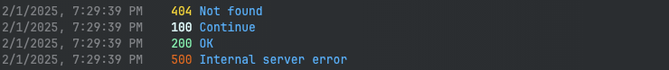

# LogBot

LogBot is a simple logger written in TypeScript. It works in both Node.js and bun.

## Installation

Use your favourite package manager to install LogBot.

```bash
npm install logbotjs
```

## Usage

```typescript
import { LogBot } from "logbotjs"

const logger = new LogBot({
    logfile: "./log.txt",
})

//alternatively
logger.setLogFilePath("./log.txt")

logger.log(404, "Not found")
logger.log(200, "OK")
logger.log(500, "Internal server error")
```

Will print to console:



And will write to `log.txt`:

```
[2021-08-01 12:00:00] [404] Not found
[2021-08-01 12:00:01] [200] OK
[2021-08-01 12:00:02] [500] Internal server error
```

# Widgets

## Spinner

```typescript
logger.widgets.spinner.start('spinner1', 'Loading...')
logger.widgets.spinner.update('spinner1', 'Loading... 50%')
logger.widgets.spinner.end('spinner1')
```

## Progressbar

```typescript
logger.widgets.progress.start('progress1', 'Downloading...', 100)
logger.widgets.progress.update('progress1', 50)
logger.widgets.progress.increment('progress1', 50)
logger.widgets.progress.end('progress1')
```

